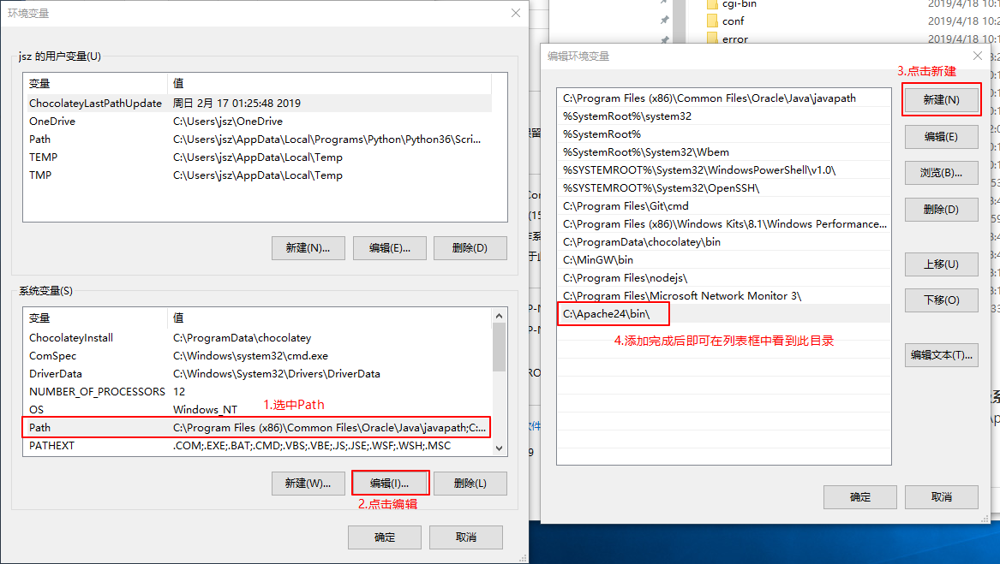
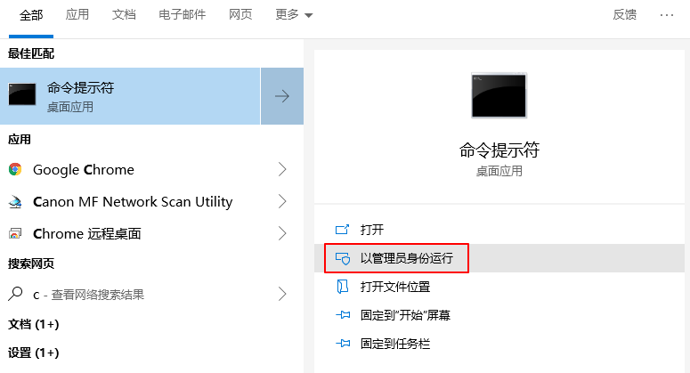
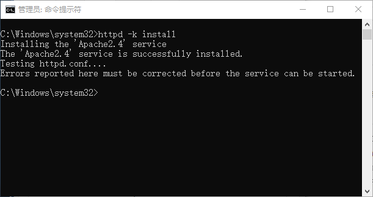
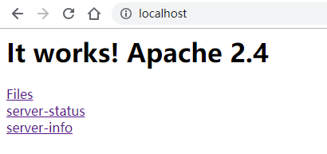
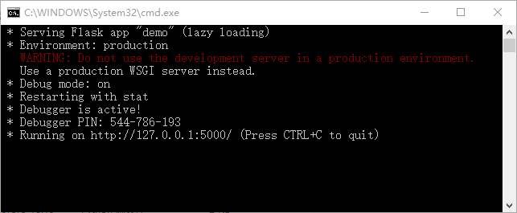

# ApacheAssistant安装指南

## Windows平台安装Apache

性能管理和模块管理的功能需要与Apache程序交互，因此需要在Windows平台下安装Apache并安装为服务，具体的安装步骤如下：

### 1.下载并解压

下载Apache24.zip压缩包(如已经clone本项目，压缩包就在demo文件夹中)，链接：https://raw.githubusercontent.com/buaa0110/ApacheAssistant/master/demo/Apache24.zip

解压到C盘根目录下，解压后的路径和文件目录如下图所示


### 2.添加环境变量

右击“**此电脑**”，点击“**属性**”，在弹出的对话框中点击左侧的“**高级系统设置**”，然后选择“**高级**”选项卡中的“**环境变量**”，然后在系统变量的Path中加入Apache程序的执行目录C:\Apache24\bin\



### 3.安装服务

使用**管理员权限**打开cmd



在cmd命令提示符窗口中输入

```shell
httpd -k install
```

即可将Apache安装为服务，安装过程如下图所示



### 4.启动/关闭Apache

使用命令行启动或关闭Apache必须使用**管理员权限**（类似于Linux下的sudo权限），在cmd中输入以下命令可以完成启动/关闭Apache等操作

```shell
httpd -k start	#启动Apache
httpd -k stop	#关闭Apache
```

启动Apache后在浏览器中输入localhost，即可看到Apache的页面



## ApacheAssistant安装及运行

首先安装**Python 3.5及以上**版本，然后安装以下依赖库

```
pip install flask apacheconfig apache_log_parser psutil sqlitedict
```

下载ApacheAssistant的Git仓库

```shell
git clone https://github.com/buaa0110/ApacheAssistant.git
```

进入仓库内的demo文件夹，双击demo目录下的“**使用管理员权限启动demo**”文件，即可自动使用管理员权限启动demo，启动后效果如下图所示



在浏览器中输入127.0.0.1:5000即可看到页面


## 功能说明

### Apache文件的默认路径

|            | 默认路径                    |
| ---------- | --------------------------- |
| Apache目录 | C:\Apache24\                |
| 配置文件   | C:\Apache24\conf\httpd.conf |
| 日志文件   | C:\Apache24\logs\access.log |

### 性能监控功能说明

Apache的网页默认目录位置是Apache目录中的htdocs文件夹，可在其中的files文件夹中加入一个较大文件，便于监控网络速度


在Apache启动的情况下，使用另外的电脑或者手机（使用本机直接下载不会计入Apache进程的网络流量），通过内网的IP地址访问Apache服务器，下载此文件，即可在性能监控页面看到网速监控结果

**在浏览器访问此文件时的页面**


**网速监控结果**

