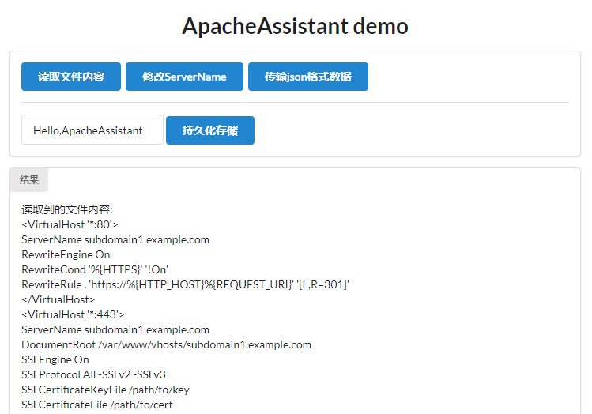
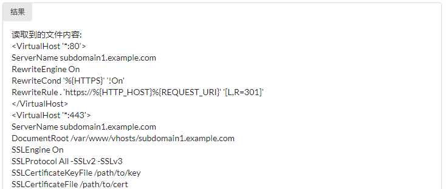

# ApacheAssistant demo

ApacheAssistant demo项目搭建好了前端和后端框架，并实现前端和后端的数据传输、配置文件解析、文件读写等具体功能，可作为正式开发时的参考代码

## 安装及运行

首先安装Python 3.5及以上版本，然后安装flask包

```
pip install flask
```

进入demo.py所在目录，执行

```
python demo.py
```

在浏览器中输入localhost:5000即可看到页面



## 使用的框架

- 后端框架

  Flask（使用Python编写的轻量级Web框架，参考教程：http://docs.jinkan.org/docs/flask/index.html）

- 前端框架

  jQuery（快速、简洁的JavaScript框架，参考教程：http://www.runoob.com/jquery/jquery-tutorial.html）

  Semantic-UI（简单、美观的CSS框架，官方网站：https://semantic-ui.com/）

- 解析配置文件

  使用Python实现的Apache配置文件解析库（https://github.com/mikemrm/ApacheConfigParser），暂时作为样例使用，可能功能不是特别全

## 功能介绍

#### 读取文件内容

读取本机的文件内容并展示在页面上

#### 修改ServerName

调用ApacheConfigParser解析配置文件，并修改ServerName属性为qq.com

#### 传输json格式数据

前后端双向传输json格式的数据

#### 持久化存储

点击按钮后将文本框里的内容存储到settings.json文件中，并在页面加载时自动读取内容

[注]该功能可用于实际项目中配置文件路径的存储，这里仅做一个样例，如果需要存储的数据较多，可以考虑使用SQLite作为存储单元

## 功能实现

#### 以读取文件内容为例

1. 用户点击<读取文件内容>按钮

2. 前端向后端/api/readfile/发出GET请求，具体代码如下：

   ```javascript
   //templates/index.html文件
   //<读取文件内容>按钮
   $('#readfile').click(function () {
       //发送GET请求
       $.get('/api/readfile/', function (data) {
           //显示结果
           $('#result').text(data)
           $('#result').html($('#result').html().replace(/\n/g, '<br/>'))
       })
   })
   ```

3. 后端收到请求，读取本机上指定位置的文件，然后将文件内容传输给前端，具体代码如下：

   ```python
   #demo.py文件
   #GET请求后端示例，实现读取文件内容功能
   @app.route('/api/readfile/')
   def readfile():
       with open('ApacheConfigParser/examples/test_apache_config.conf','r') as f:
           text=f.read()
       result='读取到的文件内容:\n'+text
       return result
   ```

4. 前端收到内容后在页面中显示文件内容

   

## 文件结构

与项目相关的文件和文件夹有：

| 文件或文件夹        | 功能                     |
| ------------------- | ------------------------ |
| demo.py             | 后端入口                 |
| settings.json       | 持久化存储内容的文件     |
| static/             | 前端js、css文件存储位置  |
| templates/          | 前端页面html文件存储位置 |
| ApacheConfigParser/ | ApacheConfigParser库     |