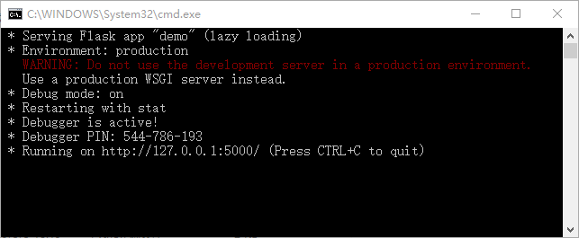
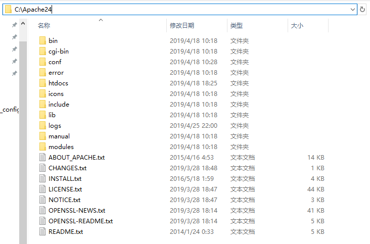
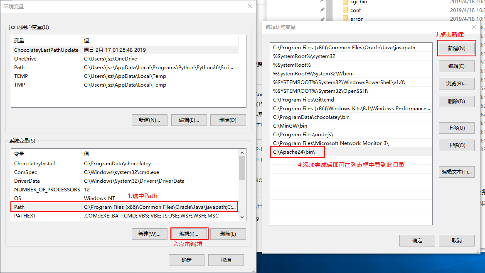
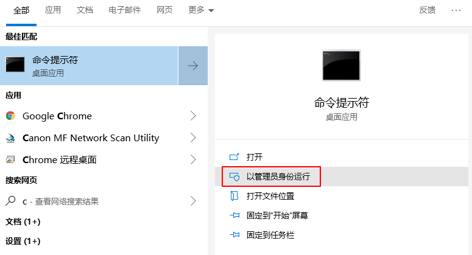
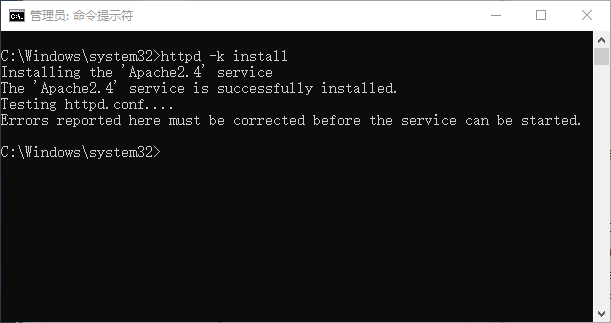
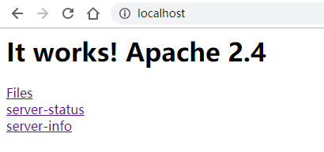

# ApacheAssistant demo

此项目现作为ApacheAssistant的正式开发项目，原demo链接：https://github.com/jisuozhao/ApacheAssistantDemo


## 安装及运行

首先安装Python 3.5及以上版本，然后安装flask等依赖库

```
pip install flask apacheconfig apache_log_parser psutil sqlitedict
```

进入demo.py所在目录，执行

```
python demo.py
```

由于**性能监控**和**模块管理**部分需要管理员权限才能与Apache程序本身进行交互，请按照下方提示安装好Apache后，双击demo目录下的“**使用管理员权限启动demo**”文件，即可自动使用管理员权限启动demo，启动后效果如下图所示



在浏览器中输入127.0.0.1:5000即可看到页面

## 后端开发进度

### API版本：V0.4

- 增加/api/save_apache_path/保存Apahce目录路径的API
- 增加/api/load_apache_path/读取保存的Apache目录路径的API
- 【性能监控】查看apache的性能参数API(/api/apache_params/)无法获取到实时的网络速度，返回的值为网络传输量network_data，前端需要每隔1s发送请求，网络速度为两次network_data的差值，单位为MB
- 【模块管理】获得模块列表API(/api/modules_list/)后端发送的数据格式进行调整，返回的模块列表分为两个表，static_list中的是静态的模块，不可安装/卸载，shared_list中是动态模块，可以安装/卸载

### API版本：V0.3

- 增加/api/clear_log_text/ 清除日志文件内容的API
- 增加/api/backup_log_text/ 备份日志文件内容的API
- 增加/api/filter_log_text/ 根据参数筛选日志文件内容的API
- 删除/api/save_log_text/ 考虑到没有修改日志文件内容的需求，删除该API

### API版本：V0.2

- /api/save_config/ 修改配置文件API修改为前端仅发送要修改的项
- 增加/api/load_all_settings/ 查看所有保存的信息（如配置文件路径等）API，用于读取database.sqlite文件，仅用于debug


### API实现进度

#### 配置管理

- [x] /api/save_config_path/	保存Apache配置文件路径
- [x] /api/load_config_path/	读取保存的Apache配置文件路径
- [x] /api/load_config/	读取解析好的Apahce配置文件信息
- [x] /api/save_config/	修改配置文件（前端仅发送要修改的项）

#### 日志管理

- [x] /api/save_log_path/	保存Apache日志文件路径
- [x] /api/load_log_path/	读取保存的Apache日志文件路径
- [x] /api/load_log_text/	读取Apahce日志文件文本并解析
- [x] /api/clear_log_text/	清除Apahce日志文件内容
- [x] /api/backup_log_text/	备份Apahce日志文件内容
- [x] /api/filter_log_text/	按字段筛选Apahce日志文件内容

#### 性能监控

- [x] /api/save_apache_path/	保存Apache目录路径
- [x] /api/load_apache_path/	读取保存的Apache目录路径
- [x] /api/apache_status/	查看apache系统状态(running/stop)
- [x] /api/control_apache/	改变apache系统状态(stop/start/restart)
- [x] /api/apache_params/	查看apache的性能参数

#### 模块管理

- [x] /api/modules_list/	获得模块列表
- [x] /api/install_module/	安装模块
- [x] /api/remove_module/	卸载模块

#### 全局工具

- [x] /api/load_all_settings	查看所有保存的信息

## 前端发送json数据到后端的代码示例

```javascript
$.ajax({
    url: '/api/save_config_path/',
    data: JSON.stringify({ 'path': '乱写的' }),
    type: 'POST',
    dataType: 'json', //收到的数据格式
    contentType: 'application/json;charset=utf-8', //发送的数据格式
    success: function (data) {
        //发送成功
        console.log('成功')
        console.log(data)
    },
    error: function(data){
        //后端返回error
        console.log('失败')
        console.log(data)
    }
})
```

## 使用的框架

- 后端框架

  Flask（使用Python编写的轻量级Web框架），参考教程：http://docs.jinkan.org/docs/flask/index.html

- 前端框架

  jQuery（快速、简洁的JavaScript框架），参考教程：http://www.runoob.com/jquery/jquery-tutorial.html

  Semantic-UI（简单、美观的CSS框架），官方网站：https://semantic-ui.com/

## 文件结构

与项目相关的文件和文件夹有：

| 文件或文件夹    | 功能                                                   |
| --------------- | ------------------------------------------------------ |
| demo.py         | 后端入口                                               |
| database.sqlite | 持久化存储内容的SQLite数据库文件                       |
| static/         | 前端js、css文件存储位置                                |
| templates/      | 前端页面html文件存储位置                               |
| example_config/ | 配置文件示例httpd.conf和日志文件示例access.log存储位置 |

## 使用Postman测试后端API

Postman是一款功能强大的HTTP请求测试软件，常用于Web开发与测试

以/api/save_config_path/ 保存Apache配置文件路径为例测试后端API的具体功能

### 1.下载Postman并安装

https://www.getpostman.com/

### 2.运行demo.py，启动Postman

发送请求的操作如图所示


## Windows平台安装Apache

性能管理和模块管理的功能需要与Apache程序交互，因此需要在Windows平台下安装Apache并安装为服务(Linux下使用apt-get即可，无需手动操作)

具体的安装步骤如下

### 1.下载并解压

下载Apache24.zip压缩包，链接：https://raw.githubusercontent.com/buaa0110/ApacheAssistant/master/demo/Apache24.zip

解压到C盘根目录下，解压后的路径和文件目录如下图所示



### 2.添加环境变量

右击“**此电脑**”，点击“**属性**”，在弹出的对话框中点击左侧的“**高级系统设置**”，然后选择“**高级**”选项卡中的“**环境变量**”，然后在系统变量的Path中加入Apache程序的执行目录C:\Apache24\bin\



### 3.安装服务

使用**管理员权限**打开cmd



在cmd命令提示符窗口中输入

```shell
httpd -k install
```

即可将Apache安装为服务，安装过程如下图所示



### 4.启动/关闭Apache

使用命令行启动或关闭Apache必须使用**管理员权限**（类似于Linux下的sudo权限），在cmd中输入以下命令可以完成启动/关闭Apache等操作

```shell
httpd -k start	#启动Apache
httpd -k stop	#关闭Apache
httpd -h		#查看Apache的其他命令
```

启动Apache后在浏览器中输入localhost，即可看到Apache的页面


