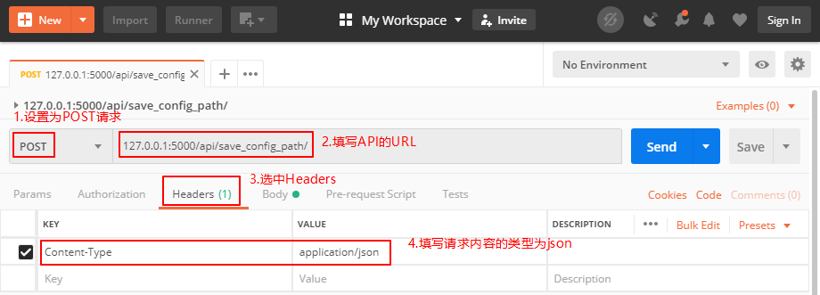
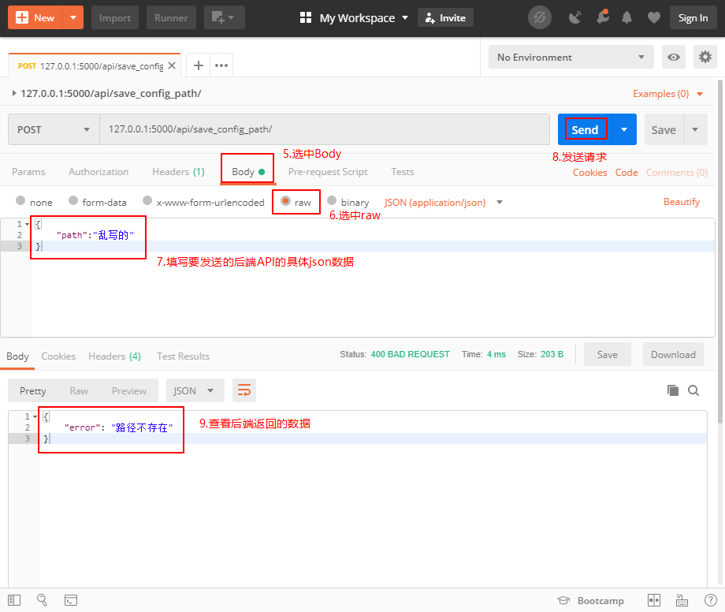
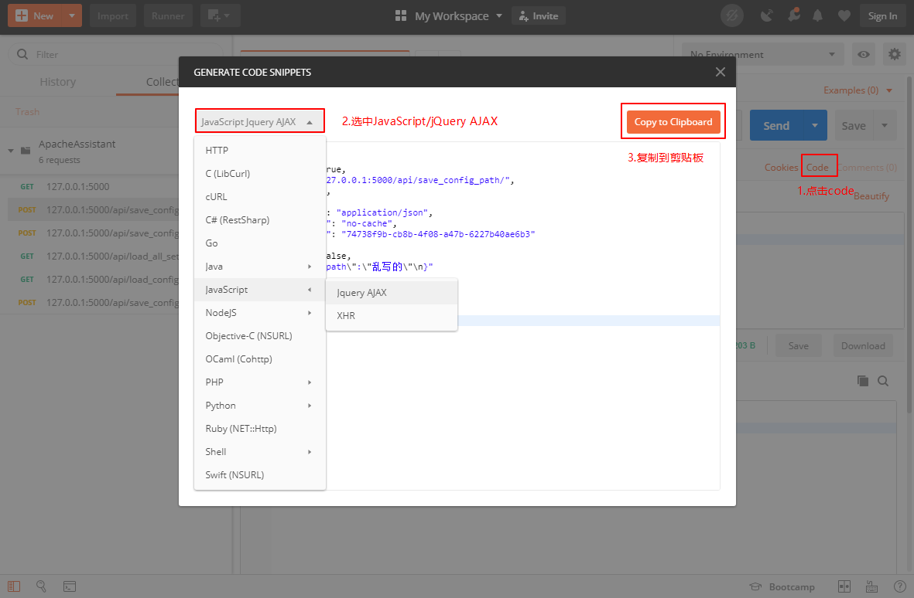

# ApacheAssistant demo

此项目现作为ApacheAssistant的正式开发项目，原demo链接：https://github.com/jisuozhao/ApacheAssistantDemo

## 安装及运行

首先安装Python 3.5及以上版本，然后安装flask等依赖库

```
pip install flask apacheconfig apache_log_parser psutil sqlitedict
```

进入demo.py所在目录，执行

```
python demo.py
```

在浏览器中输入127.0.0.1:5000即可看到页面

## 后端开发进度

### API版本：V0.2

- /api/save_config/ 修改配置文件API修改为前端仅发送要修改的项
- 增加/api/load_all_settings/ 查看所有保存的信息（如配置文件路径等）API，用于读取database.sqlite文件，仅用于debug

### API实现进度

#### 配置管理

- [x] /api/save_config_path/	保存Apache配置文件路径
- [x] /api/load_config_path/	读取保存的Apache配置文件路径
- [x] /api/load_config/	读取解析好的Apahce配置文件信息
- [x] /api/save_config/	修改配置文件（前端仅发送要修改的项）

#### 日志管理

- [x] /api/save_log_path/	保存Apache日志文件路径
- [x] /api/load_log_path/	读取保存的Apache日志文件路径
- [x] /api/load_log_text/	读取Apahce日志文件文本
- [x] /api/save_log_text/	保存修改过的Apahce日志文件文本

#### 性能监控

- [ ] /api/apache_status/	查看apache系统状态(running/stop)
- [ ] /api/control_apache/	改变apache系统状态(stop/start/restart)
- [ ] /api/apache_params/	查看apache的性能参数

#### 模块管理

- [ ] /api/modules_list/	获得模块列表
- [ ] /api/install_module/	安装模块
- [ ] /api/remove_module/	卸载模块

#### 全局工具

- [x] /api/load_all_settings	查看所有保存的信息

## 使用的框架

- 后端框架

  Flask（使用Python编写的轻量级Web框架），参考教程：http://docs.jinkan.org/docs/flask/index.html

- 前端框架

  jQuery（快速、简洁的JavaScript框架），参考教程：http://www.runoob.com/jquery/jquery-tutorial.html

  Semantic-UI（简单、美观的CSS框架），官方网站：https://semantic-ui.com/

## 文件结构

与项目相关的文件和文件夹有：

| 文件或文件夹    | 功能                                                   |
| --------------- | ------------------------------------------------------ |
| demo.py         | 后端入口                                               |
| database.sqlite | 持久化存储内容的SQLite数据库文件                       |
| static/         | 前端js、css文件存储位置                                |
| templates/      | 前端页面html文件存储位置                               |
| example_config/ | 配置文件示例httpd.conf和日志文件示例access.log存储位置 |

## 使用Postman测试后端API

Postman是一款功能强大的HTTP请求测试软件，常用于Web开发与测试

以/api/save_config_path/ 保存Apache配置文件路径为例测试后端API的具体功能

#### 1.下载Postman并安装

https://www.getpostman.com/

#### 2.运行demo.py，启动Postman

发送请求的操作如图所示





#### 3.使用Postman生成前端发送请求的js代码

Postman可以自动生成各种变成语言的请求代码，生成js代码的操作如图所示



生成的js代码（稍作修改即可用于前端页面）：

```javascript
var settings = {
  "async": true,
  "crossDomain": true,
  "url": "http://127.0.0.1:5000/api/save_config_path/",
  "method": "POST",
  "headers": {
    "Content-Type": "application/json",
    "cache-control": "no-cache",
    "Postman-Token": "74738f9b-cb8b-4f08-a47b-6227b40ae6b3"
  },
  "processData": false,
  "data": "{\n\t\"path\":\"乱写的\"\n}"
}

$.ajax(settings).done(function (response) {
  console.log(response);
});
```

